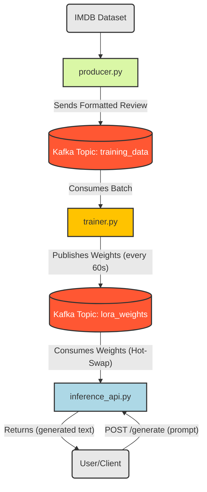

This document provides a detailed walkthrough of the core files in the InfiniTune project. Each file is broken down into its logical code blocks, explaining *what* the code does and *why* it's implemented that way, based on the project's architecture.

---

## 1. `config.yaml`

### Purpose
This is a unified configuration file used to manage all key parameters for the entire system. It allows for flexible deployment and experimentation (e.g., swapping models, changing [[3. LoRA (Low-Rank Adaptation)]] rank) without modifying the Python source code.

### Model & Kafka Configuration
```yaml
base_model: "Qwen/Qwen2-0.5B-Instruct"

kafka:
  bootstrap_servers: "localhost:9092"
  data_topic: "training_data"
  weights_topic: "lora_weights"
```
> **Explanation:**
> * **`base_model`**: The project uses `Qwen/Qwen2-0.5B-Instruct`, a 0.5 billion parameter model. This is a very small and fast model, making it ideal for rapid experimentation on consumer hardware (like the report's RTX 4080).
> * **`kafka`**: This block defines the connection string for the [[2. Apache Kafka]] server and, most importantly, the names for the two topics that form the core of the [[1. Pub-Sub Model (Publish-Subscribe Model)]] architecture:
    * `training_data`: Used to stream the IMDB reviews.
    * `weights_topic`: Used to stream the updated LoRA weights.

### LoRA Configuration
```yaml
lora:
  rank: 8
  alpha: 16
  dropout: 0.05
  target_modules:
    - "q_proj"
    - "v_proj"
```
> **Explanation:** This block defines the hyperparameters for [[3. LoRA (Low-Rank Adaptation)]], which is the core of our [[2. Parameter-Efficient Fine-Tuning (PEFT)]] strategy.
> * **`rank: 8`**: This is the 'r' value, or the rank (dimension) of the tiny adapter matrices. A smaller rank means fewer trainable parameters and faster updates.
> * **`alpha: 16`**: This is a scaling factor for the LoRA weights. A common convention is to set `alpha` to be 2x the `rank`.
> * **`target_modules`**: This is a key optimization. Instead of targeting all linear layers, the code *only* injects LoRA adapters into the "query" (`q_proj`) and "value" (`v_proj`) matrices within the [[3. Self-Attention Mechanisms]] blocks. This is a very common and memory-efficient strategy.

### Training Configuration
```yaml
training:
  optimizer: "AdamW"
  learning_rate: 0.0002
  batch_size: 2
  gradient_accumulation_steps: 4
  update_interval_sec: 60
```
> **Explanation:**
> * **`batch_size: 2`**: The `trainer.py` will process data in very small batches of 2.
> * **`gradient_accumulation_steps: 4`**: This is the technique to overcome a small batch size. The trainer will accumulate gradients over 4 batches of size 2 *before* updating the model. This achieves an **effective batch size of 8** (`2 * 4`) without needing the GPU memory for a full batch of 8.
> * **`update_interval_sec: 60`**: A custom parameter for the trainer. It will publish its newly trained weights to the `weights_topic` every 60 seconds.

---

## 2. `producer.py` (The Data Generator)

### Purpose
This service is a [[1. Pub-Sub Model (Publish-Subscribe Model)]]. It loads the `imdb` dataset, formats it into a specific prompt structure, and streams it sample-by-sample into the `training_data` topic.

### Imports & Setup
```python
import yaml
from kafka import KafkaProducer
from datasets import load_dataset
import time

# Load configuration from our YAML file
with open("config.yaml", 'r') as f:
    config = yaml.safe_load(f)

KAFKA_SERVER = config['kafka']['bootstrap_servers']
DATA_TOPIC = config['kafka']['data_topic']
```
> **Explanation:** Standard imports for `kafka-python`, `yaml`, and the [[2. Hugging Face Transformers]] library. The config is loaded to get the Kafka server address and topic name.

### Producer Initialization & Data Loading
```python
producer = KafkaProducer(
    bootstrap_servers=KAFKA_SERVER,
    value_serializer=lambda v: str(v).encode('utf-8')
)

dataset = load_dataset("imdb", split="train")
dataset = dataset.shuffle(seed=42) # Shuffle the dataset for better training

print(f"Starting producer to stream to topic '{DATA_TOPIC}'...")
```
> **Explanation:**
> * The `KafkaProducer` is initialized. The `value_serializer` tells it to convert our string data into `utf-8` bytes, which is Kafka's required format.
> * The `imdb` dataset is loaded and then **shuffled**. Shuffling is crucial for training to ensure the model doesn't see data in a biased order (e.g., all positive reviews, then all negative reviews).

### The Main Producer Loop
```python
for i, sample in enumerate(dataset):
    try:
        # Format the data into a specific prompt template
        text_data = f"### Instruction:\nSentiment: {sample['label']}\n\n### Review:\n{sample['text']}"
        
        # Send to Kafka
        producer.send(DATA_TOPIC, value=text_data)
        
        if (i + 1) % 100 == 0:
            print(f"Sent {i + 1} messages.")
            
    except Exception as e:
        print(f"Error sending message: {e}")
        time.sleep(1) # Wait a second if an error occurs

producer.flush()
producer.close()
```
> **Explanation:**
> * **`text_data = f"..."`**: This is a **critical** part of the implementation. The raw data isn't just sent as-is. It's formatted into a specific **instruction-following prompt**. This trains the [[1. Large Language Models (LLMs)]] to respond to this template, which is a key part of [[1. Fine-Tuning]].
> * **`producer.send(...)`**: This command sends the formatted string to the `training_data` topic.
> * **No Delays**: Unlike the experimental setup mentioned in the report, this final code does *not* have `time.sleep` delays in the main loop. It streams as fast as Kafka can handle it, with a brief pause *only* if an error occurs.

---

## 3. `trainer.py` (The QLORA Trainer)

### Purpose
This is the "brain" of the operation. It's a service that:
1.  **Consumes** the formatted data stream from `training_data`.
2.  **Trains** the model in real-time using [[4. QLoRA]].
3.  **Produces** the updated [[3. LoRA (Low-Rank Adaptation)]] adapter weights to `lora_weights`.

### Model & [[4. QLoRA]] Setup
```python
import yaml
import torch
import io
import time
from kafka import KafkaConsumer, KafkaProducer
from transformers import AutoModelForCausalLM, AutoTokenizer, BitsAndBytesConfig
from peft import LoraConfig, get_peft_model, prepare_model_for_kbit_training

# --- 1. Load Config ---
with open("config.yaml", 'r') as f:
    config = yaml.safe_load(f)

# --- 2. QLoRA Config (from config.yaml) ---
bnb_config = BitsAndBytesConfig(
    load_in_4bit=True,
    bnb_4bit_quant_type="nf4",
    bnb_4bit_compute_dtype=torch.bfloat16
)

# --- 3. LoRA Config (from config.yaml) ---
lora_config = LoraConfig(
    r=config['lora']['rank'],
    lora_alpha=config['lora']['alpha'],
    target_modules=config['lora']['target_modules'],
    lora_dropout=config['lora']['dropout'],
    bias="none",
    task_type="CAUSAL_LM"
)
```
> **Explanation:** We import all necessary libraries. `BitsAndBytesConfig` is for the "Q" (Quantization) and `LoraConfig` is for the "LoRA". We then create the configuration objects directly from our `config.yaml` file.

### Model & Tokenizer Loading
```python
# --- 4. Load Model in 4-bit ---
model = AutoModelForCausalLM.from_pretrained(
    config['base_model'],
    quantization_config=bnb_config,
    device_map="auto" # Automatically uses the GPU
)

# --- 5. Load Tokenizer ---
tokenizer = AutoTokenizer.from_pretrained(config['base_model'])
tokenizer.pad_token = tokenizer.eos_token
```
> **Explanation:**
> * `AutoModelForCausalLM.from_pretrained`: This one command loads the base model. Critically, we pass `quantization_config=bnb_config`, which tells [[2. Hugging Face Transformers]] to automatically download and quantize the model to 4-bits. `device_map="auto"` handles sending it to the GPU.
> * `tokenizer.pad_token = tokenizer.eos_token`: This is a standard and crucial step for Causal (decoder-only) LMs. It tells the tokenizer to use the "end of sentence" token for padding, which prevents the model from getting confused by a separate padding token.

### Applying PEFT
```python
# --- 6. Apply PEFT / LoRA ---
model = prepare_model_for_kbit_training(model)
model = get_peft_model(model, lora_config)
model.train() # Set model to training mode

model.config.use_cache = False # Disable caching for training
```
> **Explanation:**
> * `prepare_model_for_kbit_training`: A helper function that prepares the 4-bit quantized model for training.
> * `get_peft_model`: This is the magic. It wraps the base model with the trainable [[3. LoRA (Low-Rank Adaptation)]] adapter layers specified in our `lora_config`. Only these tiny adapters will have their gradients calculated.
> * `model.train()`: Puts the model in training mode (enables dropout, etc.).

### Training Setup & Loop (Part 1: Batching & Forward Pass)
```python
optimizer = torch.optim.AdamW(model.parameters(), lr=config['training']['learning_rate'])

consumer = KafkaConsumer(
    config['kafka']['data_topic'],
    bootstrap_servers=config['kafka']['bootstrap_servers'],
    auto_offset_reset='earliest',
    group_id='trainer-group' # Simple group ID
)
producer = KafkaProducer(bootstrap_servers=config['kafka']['bootstrap_servers'])

batch = []
step = 0
last_update_time = time.time()
grad_accumulation_steps = config['training']['gradient_accumulation_steps']
batch_size = config['training']['batch_size']
update_interval = config['training']['update_interval_sec']

print("Starting QLoRA Trainer...")
for message in consumer:
    batch.append(message.value.decode('utf-8'))
    
    # Check if batch is full
    if len(batch) == batch_size:
        # 1. Prepare Batch
        inputs = tokenizer(
            batch, 
            return_tensors="pt", 
            padding=True, 
            truncation=True, 
            max_length=512
        ).to("cuda")
        
        # 2. Forward Pass
        outputs = model(**inputs, labels=inputs["input_ids"])
        
        # 3. Normalize Loss
        loss = outputs.loss / grad_accumulation_steps
```
> **Explanation:**
> * `optimizer = ...`: We initialize the `AdamW` optimizer. `model.parameters()` cleverly only yields the *trainable* parameters (our LoRA adapters).
> * `for message in consumer:`: This is the main [[2. Online Learning (ML)]] loop. It blocks and waits for a new message from the `training_data` topic.
> * `batch.append(...)`: It collects messages until the `batch_size` (e.g., 2) is reached.
> * `inputs = tokenizer(...)`: The batch of text is tokenized, padded, truncated to a `max_length` of 512 tokens, and moved to the GPU.
> * `outputs = model(...)`: The model performs its forward pass. By providing `labels`, the model automatically calculates the loss for us.
> * `loss = ... / grad_accumulation_steps`: The loss is normalized (divided by 4) to account for gradient accumulation.

### Training Loop (Part 2: Backward Pass & Weight Update)
```python
        # 4. Backward Pass
        loss.backward()
        
        # 5. Optimizer Step (with Gradient Accumulation)
        if (step + 1) % grad_accumulation_steps == 0:
            optimizer.step()
            optimizer.zero_grad()
            print(f"Step {step // grad_accumulation_steps + 1}: loss = {loss.item() * grad_accumulation_steps}")

        step += 1
        batch = [] # Clear batch

        # 6. Check for Weight Update (based on time)
        current_time = time.time()
        if current_time - last_update_time > update_interval:
            print(f"Sending adapter weights...")
            
            # Serialize LoRA weights to an in-memory buffer
            buffer = io.BytesIO()
            torch.save(model.state_dict(), buffer)
            buffer.seek(0)
            
            # Send weights to Kafka
            producer.send(config['kafka']['weights_topic'], buffer.getvalue())
            producer.flush()
            
            print("Weight update sent.")
            last_update_time = current_time
```
> **Explanation:**
> * `loss.backward()`: [[3. PyTorch]] computes the gradients for the adapter weights.
> * `if (step + 1) % ...`: This block runs every 4 batches (as per our config). It performs the `optimizer.step()` (which updates the weights) and `optimizer.zero_grad()` (which clears the gradients for the *next* accumulated batch).
> * `if current_time - ...`: This check runs every loop. If 60 seconds have passed, it triggers the "produce" logic.
> * `buffer = io.BytesIO()`: Instead of saving weights to disk, we save them to an *in-memory* byte buffer.
> * `torch.save(model.state_dict(), buffer)`: We save the model's `state_dict`, which contains *only* the tiny, updated LoRA adapter weights.
> * `producer.send(...)`: The raw bytes from the buffer are sent as a message to the `lora_weights` topic.

---

## 4. `inference_api.py` (The Inference Server)

### Purpose
This service runs the user-facing [[1. Flask]] API. It has two concurrent jobs:
1.  **Serve** user prompts at a `/generate` endpoint.
2.  **Consume** weight updates from `lora_weights` in a background thread and "hot-swap" them into the live model.

### Model Setup & Thread Lock
```python
import yaml
import torch
import io
import threading
from flask import Flask, request, jsonify
from kafka import KafkaConsumer
from transformers import AutoModelForCausalLM, AutoTokenizer, BitsAndBytesConfig
from peft import LoraConfig, get_peft_model, prepare_model_for_kbit_training

# --- 1. Load Config & Model (Identical to trainer.py) ---
# ... (Same bnb_config, lora_config, model, and tokenizer loading as trainer.py) ...

model.eval() # Set model to evaluation mode

# --- 2. Thread-Safety Lock ---
model_lock = threading.Lock()
```
> **Explanation:**
> * The setup is **identical** to `trainer.py`. The inference model *must* have the same 4-bit-quantized architecture to be able to load the [[3. LoRA (Low-Rank Adaptation)]] weights.
> * `model.eval()`: Puts the model in evaluation mode (disables dropout).
> * `model_lock = threading.Lock()`: This is **the most critical component for stability**. It's a "mutex" that prevents the model from being *written to* (by the Kafka thread) and *read from* (by the Flask thread) at the exact same time.

### Background Consumer Thread (The "Hot-Swap")
```python
def consume_weights():
    consumer = KafkaConsumer(
        config['kafka']['weights_topic'],
        bootstrap_servers=config['kafka']['bootstrap_servers'],
        group_id='inference-group'
    )
    print("Background weight consumer started...")
    
    for message in consumer:
        print("Received new weight update...")
        try:
            buffer = io.BytesIO(message.value)
            new_state_dict = torch.load(buffer, map_location=model.device)
            
            # --- CRITICAL SECTION: Acquire lock to update model ---
            with model_lock:
                model.load_state_dict(new_state_dict)
                print("Weight updates applied successfully.")
            # --- Lock released ---
            
        except Exception as e:
            print(f"Error applying weight update: {e}")

# Start the background thread
consumer_thread = threading.Thread(target=consume_weights, daemon=True)
consumer_thread.start()
```
> **Explanation:**
> * `def consume_weights()`: This function is built to run in its own thread.
> * `for message in consumer:`: It blocks, waiting for a new message on the `lora_weights` topic.
> * `new_state_dict = torch.load(buffer, ...)`: It loads the new weights from the message's byte content.
> * `with model_lock:`: This is the **hot-swap**. The thread pauses and waits to acquire the lock. Once it has it, it knows the Flask API is not using the model. It safely calls `model.load_state_dict` to instantly update the live model, then releases the lock.
> * `consumer_thread.start()`: This command starts the thread in the background. `daemon=True` ensures it closes when the main app closes.

### The [[1. Flask]] API Endpoint
```python
app = Flask(__name__)

@app.route("/generate", methods=["POST"])
def generate():
    try:
        prompt = request.json['prompt']
        
        # Apply the same prompt template used in training
        prompt_template = f"### Instruction:\nSentiment: \n\n### Review:\n{prompt}"
        
        inputs = tokenizer(prompt_template, return_tensors="pt").to("cuda")
        
        # --- CRITICAL SECTION: Acquire lock to read from model ---
        with model_lock:
            outputs = model.generate(**inputs, max_new_tokens=50)
        # --- Lock released ---
            
        response = tokenizer.decode(outputs[0], skip_special_tokens=True)
        return jsonify({"response": response})
        
    except Exception as e:
        return jsonify({"error": str(e)}), 500

if __name__ == "__main__":
    print(f"Starting Flask server on http://localhost:5000")
    app.run(host="0.0.0.0", port=5000)
```
> **Explanation:**
> * `@app.route(...)`: This decorator creates the `/generate` API endpoint.
> * `prompt_template = f"..."`: This is **crucial for good performance**. The model was *trained* on a specific template, so we must *use the same template* for inference. We only ask the user for the "Review" part.
> * `with model_lock:`: This is the other side of the lock. When a user request comes in, this thread *also* acquires the lock, ensuring the `consume_weights` thread can't update the model *while* it's generating text.
> * `model.generate(...)`: The model generates a response, limited to `50` new tokens.
> * `app.run(...)`: This command starts the Flask server and blocks the main thread, actively listening for user requests.


---


---


